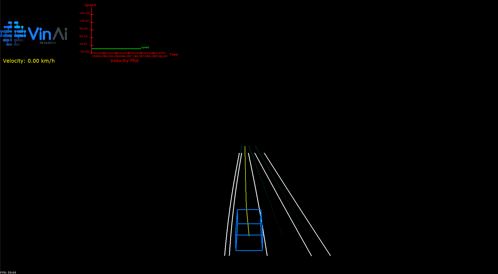

# VINAI ADAS DDS 7-May-2021

## Overview :

Our packet provides libraries, utilities (include ddslaunch, ddstopic, visualizer).

Addition, we also provide examples how to integrate our VinAI ADAS DDS into an application. It allows all applications/nodes to communicate based on one single latest version of all DDS messages. 

## Table of Contents

1. [VinAI ADAS DDS SDK](#vinai-adas-dds)

2. [Utilities](#tools)

3. [Visualizer](#visualizer)

4. [Note](#note)

## Note: This Release supports QNX only.

## <a id="vinai-adas-dds">1. VinAI ADAS DDS SDK</a>

VinAI ADAS DDS provide API to publish/subscribe data with DDS.

These are many data type headers to suppport the development.

```
Common headers: include/adas/dds/common

Data type header: include/adas/dds/idl/adas

Library: lib/armv8QNX7.0.0qcc_gpp5.4.0
```

Reference [HERE](./vinai-adas-dds/vinai-adas-dds-sdk/README.md)

## <a id="tools">2. Utilities</a>

#### 2.1 ddslaunch

The `ddslaunch` utility provides a way to launch mutiple nodes (executable binaries) at the same time using YAML configuration file. More detail [HERE](./vinai-adas-dds/utilities/ddslaunch/README.md)

#### 2.2 ddstopic

The `ddstopic` utility is a command to inspect the list of DDS topics as well as content of messages on specific topic. More detail [HERE](./vinai-adas-dds/utilities/ddstopic/README.md)

## <a id="visualizer">3. Visualizer</a>

In general, this visualizer is designed to visualize lane boundaries from lane detection module and trajectories center lines from fusion node. In this version, visualizer is currently implemented with RTI-DDS Pro version as communication requirement.



Reference [HERE](./vinai-adas-dds/visualizer/README.md)

## <a id="note">4. Note</a>

To use ADAS DDS SDK in your project, please install the sdk in a specific folder and create FindADAS\_DDS.cmake, so that libvinai\_adas\_dds.so and libvinai\_adas\_dds\_idl.so can be linked with your applications/nodes.

To use tools, visuzliser, please follow guidline to setup enviroment then we can run execute files to check resullt.
