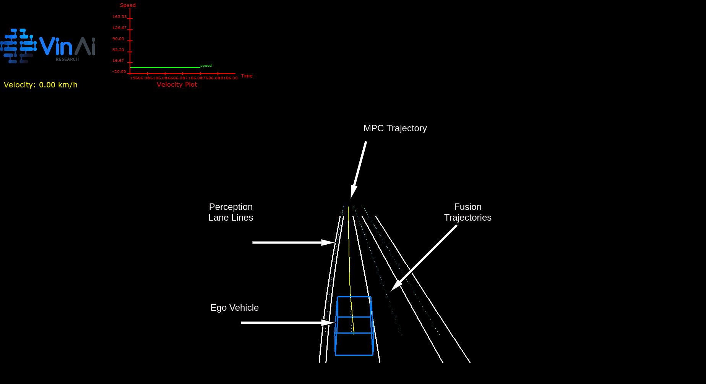

# Visualizer User Guide

In general, this visualizer is designed to visualize lane boundaries from lane detection module and trajectories center lines from fusion node. In this version, visualizer is currently implemented with RTI-DDS Pro version as communication requirement.

<em>**Note:** This visualizer only supports machine running on Linux amd64</em>



# Visualizer 3rd Party

#### These are 3rd parties of Visualizer. Please download from [3rd-party libraries](https://vingroupjsc.sharepoint.com/sites/VinAI-AutoPilot/Shared%20Documents/General/Release/Middleware/vinai-adas-dds-3rd-party-7-May-2021.tar.xz)

Extract in Release folder. We can check 3rd party libraries follow under directory:
```
/3rd-party/gl-libs

/3rd-party/driveworks

/3rd-party/pcl-common

/3rd-party/rti_connext_dds-6.0.1
```

# Inter-machines connection

Due to technical specification of RTI-DDS Pro version, the connection between different machines can be established by modifying IP field in `USER_QOS_PROFILES.xml`. Thus, it is able to visualize lane boundaries and trajectories in different machines.

# Prerequisites

Please configure the ` USER_QOS_PROFILES.xml ` in both publisher and subscriber side as follow instruction:

**For example:** If you want to run visualizer on host machine which has the IP of `192.168.20.89` subscribing the messages sent from target machine which has IP `192.168.20.127`. Then, the ` USER_QOS_PROFILES.xml` on **target machines (running publisher node)** should be configured with the IP of **host machine (which running visualizer)** and vice versa.

<em>**Publisher side:**</em>

  ```
<discovery>
    <initial_peers>
      <element>shmem://</element>  ---> Shared memory communication 
      <element>127.0.0.1</element> ---> local host configure
      <element>192.168.20.89</element> ---> Host's IP
    </initial_peers>
</discovery>
  ```

  <em>**Subscriber side (Visualizer):**</em>

  ```
<discovery>
    <initial_peers>
      <element>shmem://</element>  ---> Shared memory communication 
      <element>127.0.0.1</element> ---> local host configure
      <element>192.168.20.127</element> ---> Target's IP
    </initial_peers>
</discovery>
  ```
 # Start Visualizer

 1. Check whether subscriber and publisher connection are properly configured in `USER_QOS_PROFILES.xml`. If not please follow the instruction in [**Prerequistes**](#Prerequisites)
 2. Run visualizer with `./start_visualizer.sh`

